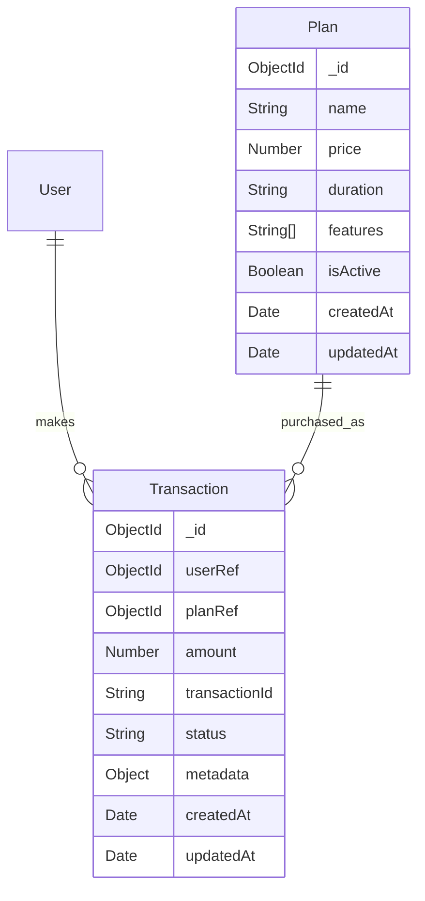

# Payment & Subscription Core Architecture

## Overview
This document describes the payment and subscription system implemented for Oppora's "Paid Listings" feature. The architecture provides a foundation for monetizing company listings through subscription plans.

## Models

### 1. Plan Model (`src/models/Plan.ts`)
Represents subscription plans that companies can purchase.

**Fields:**
- `name`: String - Plan name (e.g., 'Basic', 'Pro', 'Premium')
- `price`: Number - Price in smallest currency unit (cents/paise)
- `duration`: Enum - Billing period: `'monthly'` or `'yearly'`
- `features`: Array of Strings - List of features included in the plan
- `isActive`: Boolean - Whether the plan is available for purchase (default: `true`)
- `createdAt`, `updatedAt`: Auto-generated timestamps

**Example Plan:**
```json
{
  "name": "Pro Plan",
  "price": 2999, // $29.99
  "duration": "monthly",
  "features": ["Priority Listing", "Radar Chart Access", "Verified Badge"],
  "isActive": true
}
```

### 2. Transaction Model (`src/models/Transaction.ts`)
Tracks payment transactions for plan purchases.

**Fields:**
- `userRef`: ObjectId - Reference to User model (person paying)
- `planRef`: ObjectId - Reference to Plan model (package purchased)
- `amount`: Number - Transaction amount (should match plan price)
- `transactionId`: String - Unique ID from payment gateway (Stripe/Razorpay)
- `status`: Enum - `'pending'`, `'completed'`, `'failed'`, `'refunded'`
- `metadata`: Object - Additional gateway-specific data (invoice URL, etc.)
- `createdAt`, `updatedAt`: Auto-generated timestamps

**Indexes:**
- `userRef + createdAt` for user transaction history
- `status` for filtering by status
- `transactionId` (unique) for gateway lookups

## Controllers

### Payment Controller (`src/controllers/paymentController.ts`)

#### `getAvailablePlans()`
- **Route:** `GET /api/v1/payment/plans`
- **Access:** Public
- **Description:** Returns all active plans for the frontend "Select Plan" page
- **Response:** Array of plan objects with pricing and features

#### `initiateCheckout()`
- **Route:** `POST /api/v1/payment/checkout`
- **Access:** Private (requires authentication)
- **Description:** Creates a pending transaction record and returns checkout details
- **Input:** `{ planId: string }`
- **Logic:**
  1. Validates user authentication
  2. Verifies plan exists and is active
  3. Creates transaction with status `'pending'`
  4. Returns transaction details with mock checkout URL
- **Production Integration:** Replace mock URL with Stripe/Razorpay checkout session

#### `handlePaymentWebhook()` (Placeholder)
- **Route:** `POST /api/v1/payment/webhook`
- **Access:** Public (called by payment gateway)
- **Description:** Handles payment gateway callbacks to update transaction status

## Routes

### Payment Routes (`src/routes/paymentRoutes.ts`)
- `GET /api/v1/payment/plans` → `getAvailablePlans`
- `POST /api/v1/payment/checkout` → `initiateCheckout`
- `POST /api/v1/payment/webhook` → `handlePaymentWebhook`

## Database Schema



## Usage Examples

### 1. Fetch Available Plans (Frontend)
```javascript
// API call to get plans
const response = await fetch('/api/v1/payment/plans');
const { data: plans } = await response.json();

// Display plans to user
plans.forEach(plan => {
  console.log(`${plan.name}: $${(plan.price / 100).toFixed(2)}/${plan.duration}`);
});
```

### 2. Initiate Checkout
```javascript
// API call to start checkout
const response = await fetch('/api/v1/payment/checkout', {
  method: 'POST',
  headers: { 'Content-Type': 'application/json' },
  body: JSON.stringify({ planId: 'plan_id_here' })
});

const { data } = await response.json();
// Redirect to checkout URL
window.location.href = data.checkoutUrl;
```

### 3. Sample Plan Data
```javascript
// Seed data for initial plans
const samplePlans = [
  {
    name: 'Basic',
    price: 999, // $9.99
    duration: 'monthly',
    features: ['Standard Listing', 'Basic Analytics'],
    isActive: true
  },
  {
    name: 'Pro',
    price: 2999, // $29.99
    duration: 'monthly',
    features: ['Priority Listing', 'Radar Chart Access', 'Verified Badge', 'Advanced Analytics'],
    isActive: true
  },
  {
    name: 'Enterprise',
    price: 9999, // $99.99
    duration: 'yearly',
    features: ['All Pro Features', 'Dedicated Support', 'Custom Reports', 'API Access'],
    isActive: true
  }
];
```

## Integration with Payment Gateways

### Current Implementation
- Creates transaction records with `status: 'pending'`
- Returns mock checkout URL for development
- Ready for Stripe/Razorpay integration

### Steps for Production Integration:
1. Install payment gateway SDK (e.g., `stripe`, `razorpay`)
2. Update `initiateCheckout()` to create real payment sessions
3. Implement webhook handler to update transaction status
4. Add environment variables for API keys
5. Implement retry logic for failed payments

## Testing

### Test Script
Run the test script to verify models:
```bash
cd apps/backend
node test-payment-models.js
```

### Manual Testing Endpoints
1. `GET http://localhost:5000/api/v1/payment/plans`
2. `POST http://localhost:5000/api/v1/payment/checkout` (with auth header)

## Future Enhancements

1. **Recurring Subscriptions:** Extend Transaction model to track subscription cycles
2. **Coupon/Discount Codes:** Add discount field to Transaction
3. **Invoice Generation:** Automatically generate and store invoices
4. **Trial Periods:** Add trial days field to Plan model
5. **Usage Tracking:** Track feature usage for metered billing
6. **Multi-Currency Support:** Add currency field to Plan

## Security Considerations

1. **Authentication:** All checkout endpoints require user authentication
2. **Input Validation:** All inputs are validated using Mongoose schemas
3. **Price Integrity:** Transaction amount is locked to plan price at time of purchase
4. **Webhook Security:** Implement signature verification for payment gateway webhooks
5. **Data Privacy:** Transaction metadata may contain PII - ensure proper encryption

## Deployment Notes

1. **Environment Variables:**
   - `PAYMENT_GATEWAY_SECRET_KEY` (for production)
   - `WEBHOOK_SECRET` (for webhook verification)

2. **Database Migrations:**
   - No destructive changes to existing schemas
   - New collections: `plans`, `transactions`

3. **Monitoring:**
   - Monitor failed transaction rates
   - Set up alerts for payment gateway errors
   - Track conversion rates from pending to completed transactions